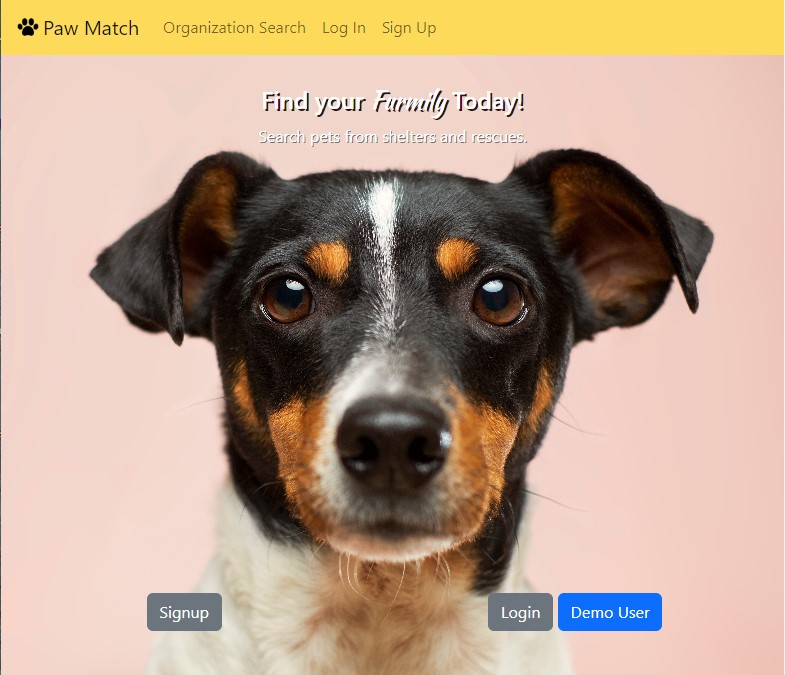
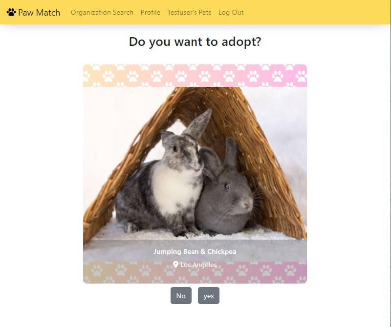
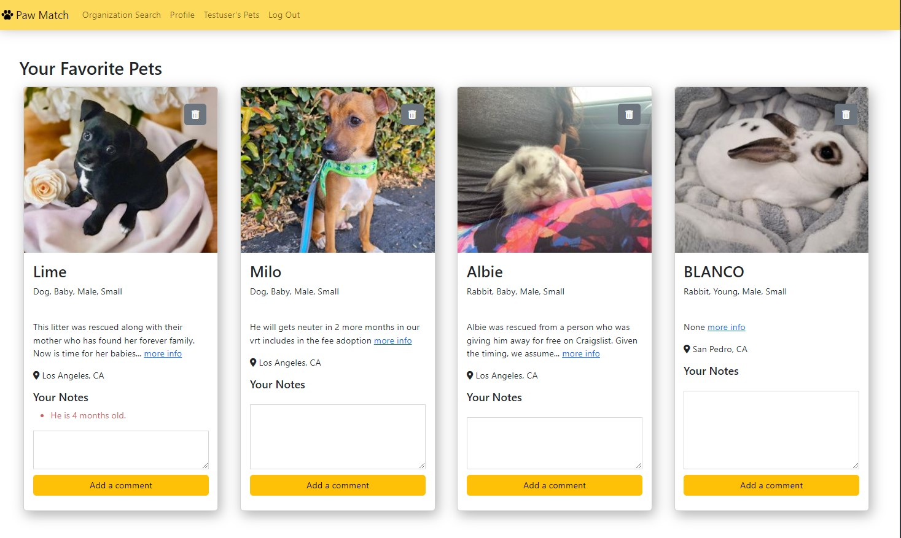

# Find Your Furmily - Paw Match
Live demo: [Paw Match](https://find-your-furmily-paw-match.onrender.com)



# Features

- Responsive website
- Search pet rescue organizations
- Search and add pets to favorite
  - App will suggest 10 or less possible pets according to a user's preference
  - A User can select yes to add a pet to their favorite pet list
  - Show a user's favorite pet list

# Built with
- Database: PostgreSQL
- Backend: Flask, Flask-SQLalchemy, Python
- Frontend: Jinja, Bootstrap, JQuery
- API : [Petfinder API](https://www.petfinder.com/developers/v2/docs/).

# Setup
#### Setting up database on postgreSQL 
1. start your PostgreSQL server and enter your password.
   ```bash
   $sudo service postgresql start
   ```
   
2. Create database in PostgreSQL (`furmily_db` is the database name)
   ```bash
   $createdb furmily_db
   ```
3. Make sure you are in the root of this project folder where `seed.py` is saved.

4. Create tables by using existing `seed.py` file. 
    ```bash
    $python3 seed.py
    ```

#### Starting Flask app on your local computer
0. Make sure to replace environment variables  `API_KEY`,`API_SECRET`, `SECRET_KEY`, `DemoUsername`, `DemoPassword` with your own. You can import them from a separate file. Also, make sure to comment out environment variables set up for deployment.
   
1. Navigate to the project folder
2. Create Virtual Environment
    ```bash
    $python3 -m venv venv
    ```
3. Open Virtual Environment. You will see `(venv)` appear in front of `$`
    ```bash
    $source venv/bin/activate
    ```
4. install dependencies
    ```bash
    $pip3 install -r requirements.txt
    ```
5. Run application
    ```bash
    $flask run
    ```


